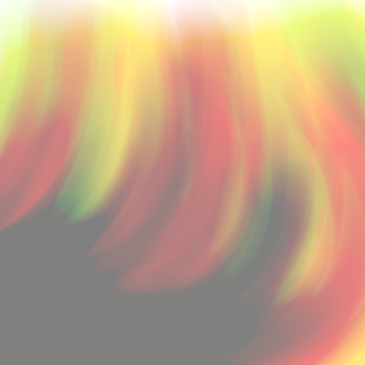
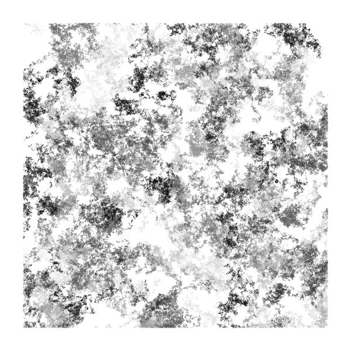
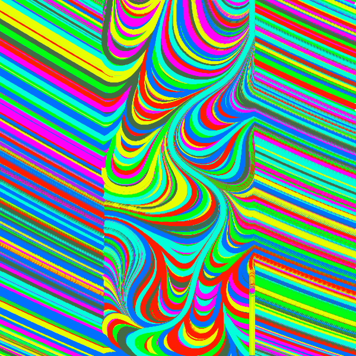
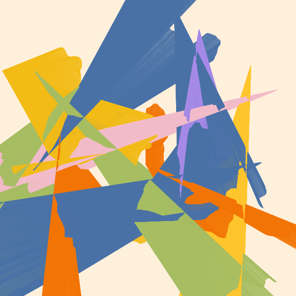
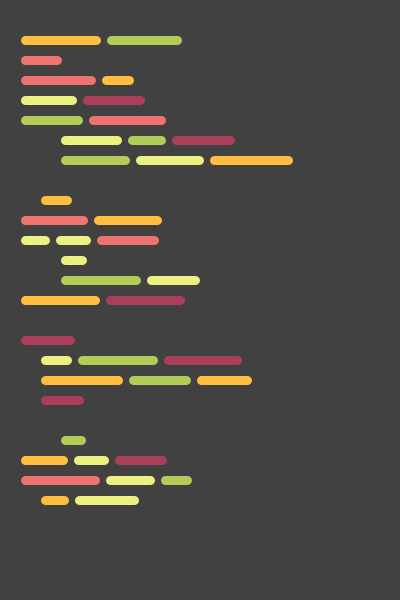

# Genuary 2023

My generative art for #genuary2023. The Genuary 2023 website and the prompts can be found [here](https://genuary.art/).

### Day 1: Infinite/Perfect loop

#### Aurorae 

Failed miserably at this prompt, but since the idea is to just create some generative art everyday, recreated some quick aurorae I worked on previously. Hey, we were encouraged to cheat!

### Day 2: Made in 10 minutes

#### Wisps

Repurposed some already written Flowlines code into 'Wisps'.

### Day 3: Glitch art

#### Glitch

### Day 4: Intersections

#### Intersections

### Day 5: Debug View

#### DebugView

Created a generative code editor since I only debug with print statements

